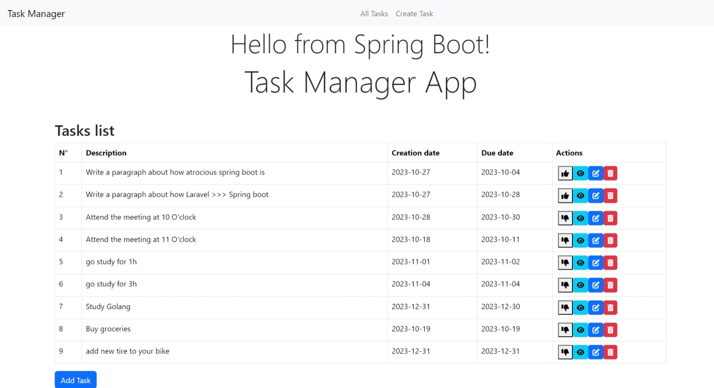

# Spring Boot CRUD App

A web application for managing tasks with Spring Boot, Thymeleaf, and Bootstrap, offering essential Create, Read, Update, and Delete (CRUD) operations on task entities.

## Screenshots



## Lessons Learned

- Developed a deep understanding of the Spring Boot framework.
- Utilized Thymeleaf templates for server-side rendering.
- Enhanced the application's appearance and user experience with Bootstrap.

## Features

- Create new tasks with descriptions, due dates, and creation dates.
- View a list of tasks, their descriptions, due dates, and creation dates.
- Edit and update existing task details.
- Remove tasks from the application.

## Technologies & Tools

**Server:** Spring Boot

**Frontend:** Thymeleaf, Bootstrap

**Database:** MySQL

## Prerequisites

- Java Development Kit (JDK)
- Integrated Development Environment (IDE) for Java
- Maven
- MySQL or a preferred database server
- Git

## Getting Started

1. Clone the repository.

   ```bash
   git clone https://github.com/Ammari-Youssef/CrudApp-Spring-Boot
 ```